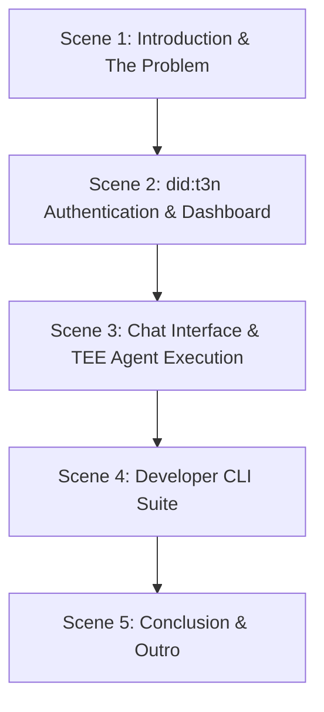

# bount-AI — Demo Video Script

This document contains the script and draft for the **bount-AI** demo video (Web3 Platform & Developer CLI for Secure TEE Enclave Marketplace).

---

## Video Specifications
- **Target Duration:** 3 - 4 Minutes
- **Format:** Screencast + Voiceover + Background Music (Upbeat Tech / Modern)

---

## Script Structure

---

### Scene 1: Introduction & The Problem (0:00 - 0:35)

* **Visual:** bount-AI landing page displaying "A Verifiable, Secure AI Agent Marketplace".
* **Cursor Actions:** Smooth scrolling down showing the problem section.
* **Voiceover:**
  > "Hello everyone! Welcome to the **bount-AI** demo video.
  > 
  > Running custom AI agents in the cloud today introduces major security challenges. Credentials like API keys are loaded directly into memory, exposing them to operators. Personally Identifiable Information (PII) is passed in plaintext, and there's no cryptographic way to verify that your agents run inside a secure enclave.
  > 
  > bount-AI solves this by integrating the **Terminal 3 Agent Dev Kit (ADK)**!"

---

### Scene 2: did:t3n Identity & Dashboard (0:35 - 1:15)

* **Visual:** Navigating to the Login page. Click "Connect Wallet" with MetaMask.
* **Cursor Actions:** Approve the MetaMask signature to log in, entering the Dashboard at `/app`.
* **Voiceover:**
  > "Here, users log in using MetaMask. This triggers a secure handshake with the **T3N SDK** to generate a portable decentralized identity: **`did:t3n`**.
  > 
  > On the main Dashboard, we can monitor our on-chain budget delegation configured via the **ERC-7710** standard, as well as real-time spent details.
  > 
  > Through our integrated **T3nSecretsManager**, sensitive credentials such as Venice AI keys are stored encrypted in the T3N KV store (`z:tenant:secrets`). These keys are resolved only within the enclave's memory at runtime and are never exposed to external hosts."

---

### Scene 3: Chat Interface & TEE Agent Execution (1:15 - 2:15)

* **Visual:** Navigating to the `/app/agents` registry, clicking an agent card (e.g., "Research Agent"). It redirects to the Chat page `/app/chat` with the input box pre-filled with the starter prompt: *"research the latest trends about "*.
* **Cursor Actions:** Append `"green energy in 2026"` to the prompt and hit Send. Observe loading status, verified T3N transaction trace, budget deduction, and markdown response.
* **Voiceover:**
  > "In the Agents registry, we can explore various specialist capabilities—ranging from research and copywriting to image generation.
  > 
  > Let's run an agent. Simply click 'Run', and we are immediately redirected to the Chat page with the chosen agent pre-filled along with its starter prompt.
  > 
  > When we submit the request, our orchestrator invokes a contract execution on a **T3N Intel TDX TEE cluster**. The WebAssembly enclave runs in isolation, fetches API keys from T3N KV storage, sanitizes PII using secure placeholders, and retrieves the output securely.
  > 
  > We can track the execution logs, verify the tamper-proof logs on the T3N ledger, and see our budget balance updated in real-time."

---

### Scene 4: Developer CLI Suite (2:15 - 3:15)

* **Visual:** Switching to a Terminal window showing `bount-ai-cli` commands.
* **Terminal Actions:**
  1. Run `npx bount-ai-cli login`
  2. Run `npx bount-ai-cli build` (compiling code to `wasm32-wasip2`)
  3. Run `npx bount-ai-cli publish` (registering contract version on T3N)
  4. Run `npx bount-ai-cli run <agent-id> "hello"` (local CLI execution)
* **Voiceover:**
  > "For developers, bount-AI provides a powerful CLI suite called `bount-ai-cli`.
  > 
  > With just a few terminal commands, developers can authenticate their local session using `login`, compile their custom agent code into a WebAssembly guest component with `build`, publish it to the T3N enclave network using `publish`, and run test executions via `run`.
  > 
  > Newly published enclaves automatically become active in the web Dashboard registry and are instantly available for users."

---

### Scene 5: Conclusion & Outro (3:15 - 3:45)

* **Visual:** Returning to the web dashboard, summarizing frontend, backend, CLI, and T3N integration. Showing the final slide with GitHub repository, NPM package, and live dApp links.
* **Voiceover:**
  > "bount-AI combines the ease of a modern conversational UI with the security guarantees of military-grade TEE enclaves. Verifiable, secure, and fully autonomous.
  > 
  > Check out our live dApp or publish your own TEE skills today! Thank you for watching!"

---

> [!TIP]
> **Video Recording Tips:**
> - Keep mouse movements smooth.
> - Record screen sessions in 1080p resolution or higher.
> - Zoom in on terminal windows to ensure command text is legible for viewers.
