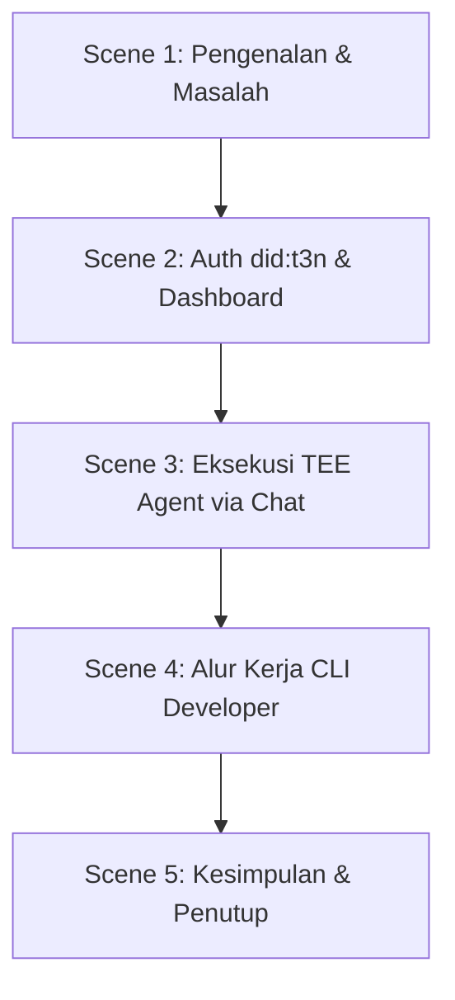

# bount-AI — Demo Video Script

Dokumen ini berisi draf naskah/skrip video demo untuk **bount-AI** (Web3 Platform & Developer CLI untuk Secure TEE Enclave Marketplace). Naskah ini ditulis dalam Bahasa Indonesia dengan panduan visual dan audio untuk memudahkan proses rekaman.

---

## Detail Video
- **Durasi Target:** 3 - 4 Menit
- **Format:** Screencast (Rekaman Layar) + Sulih Suara (Voiceover) + BGM Latar Belakang (Upbeat Tech / Modern)

---

## Struktur Naskah

---

### Scene 1: Pengenalan & Masalah (0:00 - 0:35)

* **Visual:** Tampilan landing page bount-AI yang elegan dengan logo berputar halus, teks "A Verifiable, Secure AI Agent Marketplace".
* **Tindakan Kursor:** Scroll perlahan ke bawah menampilkan grafik atau deskripsi problem.
* **Narasi (Voiceover):**
  > "Halo semuanya! Selamat datang di demo **bount-AI**.
  > 
  > Saat kita menjalankan AI Agent atau TEE Skill khusus di cloud hari ini, ada risiko besar yang kita hadapi: kebocoran API key sensitif, eksposur data pribadi (PII) pengguna ke LLM publik, dan sulitnya memverifikasi apakah agen dijalankan di lingkungan aman yang terenkripsi.
  > 
  > **bount-AI** hadir untuk memecahkan masalah ini dengan mengintegrasikan **Terminal 3 Agent Dev Kit (ADK)**!"

---

### Scene 2: Identitas `did:t3n` & Dashboard (0:35 - 1:15)

* **Visual:** Browser membuka halaman Login. Klik tombol "Connect Wallet" via MetaMask.
* **Tindakan Kursor:** Menyetujui tanda tangan MetaMask, lalu masuk ke Dashboard `/app`.
* **Narasi (Voiceover):**
  > "Di sini, pengguna masuk menggunakan MetaMask mereka. Proses ini memicu handshake aman dengan **T3N SDK** untuk membuat identitas terdesentralisasi portabel Anda: **`did:t3n`**.
  > 
  > Di Dashboard utama, kita bisa melihat status anggaran delegasi on-chain kita menggunakan standar **ERC-7710**, serta melihat data pemakaian kredit.
  > 
  > Melalui integrasi **T3nSecretsManager**, rahasia sensitif seperti kunci API Venice AI disimpan dengan aman di dalam KV store terenkripsi T3N (`z:tenant:secrets`). Kunci ini hanya akan di-resolve di dalam memori enklave tertutup saat runtime dan tidak pernah terekspos ke host luar."

---

### Scene 3: Chat & Eksekusi TEE Agent (1:15 - 2:15)

* **Visual:** Navigasi ke halaman `/app/agents` (Spesialis Agents), lalu klik salah satu agent card (misal: "Research Agent"). Layar langsung melakukan *redirect* ke halaman Chat dengan kotak input otomatis terisi prompt starter: *"research the latest trends about "*.
* **Tindakan Kursor:** Mengetik lanjutannya: `"green energy in 2026"` lalu menekan tombol Send. Menampilkan status loading eksekusi enklave, transaksi T3N terverifikasi, pengurangan budget secara real-time, dan respon markdown rapi.
* **Narasi (Voiceover):**
  > "Di katalog Agen, kita bisa melihat berbagai kemampuan spesialis—dari penelitian, penulisan, hingga pembuatan gambar.
  > 
  > Sekarang, mari kita jalankan satu agen. Cukup klik 'Run', dan kita akan diarahkan langsung ke halaman Chat dengan agen yang terpilih beserta saran prompt starter-nya!
  > 
  > Saat kita mengirim prompt, backend Orchestrator kami memicu pemanggilan kontrak aman ke **TEE Node (Intel TDX)**. Enklave WASM berjalan secara terisolasi, menarik kunci API dari KV T3N secara privat, menyamarkan data pribadi dengan placeholder pintar, dan mengeluarkan output secara aman.
  > 
  > Kita dapat melihat trace eksekusi yang nyata, log audit kriptografis yang tahan manipulasi di ledger T3N, dan sisa budget kita yang terpotong secara transparan."

---

### Scene 4: Developer CLI Workflow (2:15 - 3:15)

* **Visual:** Split screen atau beralih ke jendela Terminal. Menunjukkan developer menggunakan CLI `bount-ai-cli` (atau perintah `npx skill`).
* **Tindakan di Terminal:**
  1. Mengetik `npx bount-ai-cli login`
  2. Mengetik `npx bount-ai-cli build` (menunjukkan proses kompilasi Rust/TS ke target `wasm32-wasip2`)
  3. Mengetik `npx bount-ai-cli publish` (menunjukkan pendaftaran sukses ke node T3N)
  4. Mengetik `npx bount-ai-cli run <agent-id> "hello"` (menunjukkan eksekusi lokal dari terminal)
* **Narasi (Voiceover):**
  > "Bagi para developer, bount-AI menyediakan CLI suite tangguh bernama `bount-ai-cli`.
  > 
  > Hanya dengan beberapa perintah sederhana di terminal, developer bisa mengautentikasi identitas mereka via `login`, memaketkan logika kustom mereka menjadi WebAssembly guest component menggunakan `build`, mempublikasikan biner aman tersebut langsung ke jaringan TEE dengan `publish`, dan menguji eksekusi secara otonom menggunakan perintah `run`.
  > 
  > Semua agen yang dideploy melalui CLI ini langsung muncul di halaman Dashboard utama dan siap digunakan oleh pengguna global."

---

### Scene 5: Penutup & Call to Action (3:15 - 3:45)

* **Visual:** Kembali ke tampilan web dashboard, menunjukkan keselarasan frontend, backend, CLI, dan T3N network. Menampilkan slide penutup dengan link GitHub repository, NPM package, dan live dApp.
* **Narasi (Voiceover):**
  > "bount-AI menggabungkan kemudahan antarmuka chat modern dengan garansi keamanan enclave TEE tingkat militer. Verifiable, secure, dan sepenuhnya otonom.
  > 
  > Jelajahi live dApp kami atau publikasikan TEE skill Anda sekarang! Terima kasih telah menonton!"

---

> [!TIP]
> **Tips Rekaman Video:**
> - Pastikan kursor mouse bergerak dengan halus (opsional: aktifkan efek sorot kursor).
> - Gunakan tools seperti *ScreenFlow* atau *OBS Studio* dengan resolusi minimal 1080p.
> - Saat merekam terminal, perbesar ukuran teks (zoom in) agar perintah CLI mudah dibaca oleh penonton.
