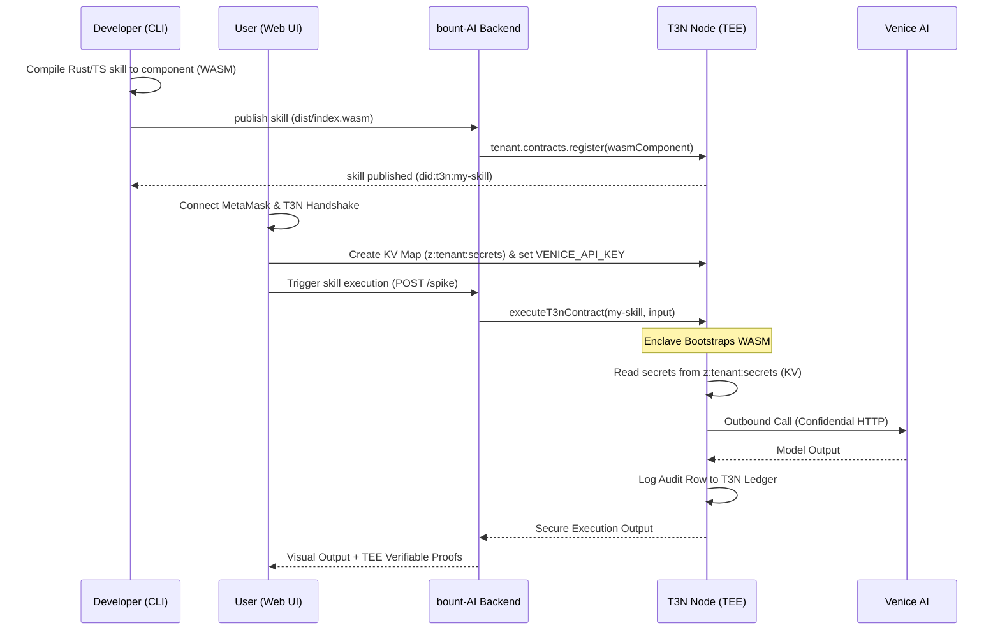

<p align="center">
  
</p>

<h1 align="center">bount-AI</h1>

<p align="center">
  <b>A Verifiable, Secure AI Agent & Enclave Marketplace powered by Terminal 3 ADK, T3N (TEE Network), WASM Sandbox, and Venice AI.</b>
</p>

<p align="center">
  <a href="https://bount-ai-web.vercel.app"><b>Live App (dApp)</b></a>
  &nbsp;|&nbsp;
  <a href="https://bount-ai-agent.vercel.app/health"><b>Agent API Health</b></a>
  &nbsp;|&nbsp;
  <a href="https://www.npmjs.com/package/bount-ai-cli"><b>NPM CLI Package</b></a>
  &nbsp;|&nbsp;
  <a href="https://github.com/maulana-tech/bount-ai"><b>GitHub Repository</b></a>
</p>

<p align="center">
  
  &nbsp;&nbsp;
  
  &nbsp;&nbsp;
  
  &nbsp;&nbsp;
  
</p>

---

bount-AI is a secure Web3 platform and developer CLI designed to build, publish, and execute AI agent enclaves. Built for the **Terminal 3 Agent Dev Kit (ADK) Bounty Challenge**, it leverages T3N clusters (Intel TDX TEEs) to safeguard user credentials, enforce privacy-preserving HTTP placeholders, and log execution audit trails. 

---

## 📌 Table of Contents

- [The Problem](#the-problem)
- [The Solution](#the-solution)
- [System Architecture](#system-architecture)
- [TEE Contract & Data Flow](#tee-contract--data-flow)
- [Terminal 3 SDK Integration (T3N ADK Focus)](#terminal-3-sdk-integration-t3n-adk-focus)
- [The Specialist Agents](#the-specialist-agents)
- [Live Deployment](#live-deployment)
- [Technical Deep Dive](#technical-deep-dive)
- [Repository Structure](#repository-structure)
- [CLI Tool Walkthrough](#cli-tool-walkthrough)
- [Getting Started (Local Development)](#getting-started-local-development)
- [Threat Model & Safety](#threat-model--safety)
- [Roadmap & Feature Status](#roadmap--feature-status)
- [Team](#team)
- [References](#references)
- [License](#license)

---

## ❌ The Problem

Running custom AI skills and agents in cloud hosts today introduces severe security risks:

* **Credential Exposure** — Agents require raw API keys (e.g. Venice AI, OpenAI, database tokens) loaded directly into memory, leaving them vulnerable to host sniffing or operator access.
* **PII Leakage** — Personally Identifiable Information (PII) of users is passed directly to LLM prompts and API endpoints in plaintext.
* **Identity Spoofing** — No standard cryptographic way to verify the authenticity of an agent or enclave's execution.
* **Unauditable Runs** — Lacking tamper-proof ledger logging, developers cannot prove the execution outcomes or intermediate agent steps.

---

## ✅ The Solution (T3N ADK Powered)

bount-AI integrates the **Terminal 3 Agent Dev Kit** to make agent execution private, verifiable, and secure:

* **Decentralized Identities (`did:t3n`):** Every user and agent gets a portable cryptographic identity linked via Ethereum/MetaMask auth.
* **TEE Enclaves (WASM Sandbox):** Custom TypeScript or Rust skills are compiled to WebAssembly guest components (`wasm32-wasip2`) and executed in Intel TDX enclaves.
* **Confidential KV Stores:** Secrets and API keys are stored in encrypted `z:<tid>:*` maps, fetched inside the enclave at runtime, and never exposed in raw code.
* **Zero-Disclosure Placeholders:** PII fields are replaced with `{{profile.email}}` placeholders. T3N's outbound gateway resolves them during HTTP calls, preventing the host machine or WASM memory from seeing plaintext PII.
* **Immutable Audit Trail:** Execution steps and outcomes are logged directly onto the T3N decentralized ledger.

---

## 🏛️ System Architecture

```mermaid
flowchart TB
    subgraph Frontend["Frontend · Next.js 15 + Tailwind"]
        UI["Dashboard · KV Maps Manager · Skill Registry"]
        T3N_Auth["T3N Handshake & Authenticate<br/>did:t3n session"]
        KV_UI["KV maps creator & profile editor"]
    end

    subgraph CLIWorkspace["CLI Workspace (bount-ai-cli)"]
        CLI["skill CLI<br/>init · build · publish · run"]
        Compiler["Rust cargo compiler<br/>wasm32-wasip2 target"]
    end

    subgraph AgentSvc["Agent Backend · Hono service"]
        Orchestrator["spike.ts<br/>orchestrator"]
        T3N_Client["t3n.ts (T3nClient & TenantClient)"]
        Sandbox["WASM Component Sandbox (executeT3nContract)"]
    end

    subgraph T3N["Terminal 3 Network (TEE)"]
        TEE_Cluster["TEE Node Enclave (Wasmtime)"]
        Conf_KV["Private KV Store (z:tenant:secrets)"]
        Ledger["T3N Immutable Ledger (Audit Trails)"]
    end

    subgraph External["External APIs"]
        Venice["Venice AI (Text & Image)"]
    end

    UI --> T3N_Auth
    UI --> KV_UI
    KV_UI -. tenant.maps .-> Conf_KV
    T3N_Auth -. handshake .-> TEE_Cluster

    CLI --> Compiler
    Compiler -. publish contract .-> T3N_Client
    
    Orchestrator --> T3N_Client
    T3N_Client --> Sandbox
    Sandbox --> TEE_Cluster
    
    TEE_Cluster --> Conf_KV
    TEE_Cluster --> Ledger
    TEE_Cluster --> External
```

---

## 🔄 TEE Contract & Data Flow

The lifecycle of an enclave registration, secret storage, and execution:



---

## 🔌 Terminal 3 SDK Integration (T3N ADK Focus)

Our integration leverages the complete set of T3N ADK capabilities:

### 1. T3N Handshake & Authentication (`did:t3n`)
* **Code Location:** [apps/agent/src/integrations/t3n.ts](file:///Users/em/web/bount-ai/apps/agent/src/integrations/t3n.ts#L30-L58)
* **Details:** Uses `@terminal3/t3n-sdk` to connect to the node, perform handshakes, and sign MetaMask EIP-191 credentials. Yields a verified, stable `did:t3n` for identity mapping.

### 2. TEE Enclave Contract Registration (`TenantClient`)
* **Code Location:** [apps/agent/src/integrations/t3n.ts](file:///Users/em/web/bount-ai/apps/agent/src/integrations/t3n.ts#L71-L93)
* **Details:** Uploads compiled `.wasm` guest component binaries to the T3N node using the `TenantClient` SDK contracts registry API.

### 3. TEE Enclave Execution (`execute`)
* **Code Location:** [apps/agent/src/integrations/t3n.ts](file:///Users/em/web/bount-ai/apps/agent/src/integrations/t3n.ts#L95-L115)
* **Details:** Invokes registered WASM contracts synchronously via `TenantClient.contracts.execute`, running inside Wasmtime on hardware-encrypted nodes.

### 4. Enclave Secrets Store Integration (KV Maps)
* **Code Location:** [packages/enclaves/src/lib.rs](file:///Users/em/web/bount-ai/packages/enclaves/src/lib.rs#L12-L28)
* **Details:** The Rust enclave component queries the T3N private KV store (`z:<tenant_id>:secrets`) to retrieve the `VENICE_API_KEY` at runtime.

### 5. Outbound HTTP with Placeholders (Zero-Disclosure)
* **Code Location:** [packages/enclaves/src/lib.rs](file:///Users/em/web/bount-ai/packages/enclaves/src/lib.rs#L30-L60) & [packages/enclaves/wit/host.wit](file:///Users/em/web/bount-ai/packages/enclaves/wit/host.wit)
* **Details:** Exports WIT definitions for `t3n:host/http` and `t3n:host/kv` to securely perform outbound calls using Venice AI's model APIs.

---

## 🤖 The Specialist Agents

The application contains built-in agent enclaves and supports user-registered hybrid enclaves:

| Agent | Purpose | Price | T3N Capability |
| --- | --- | --- | --- |
| **Research** | Gather competitive data and summaries | $0.50 | `t3n:host/http` + `t3n:host/kv` |
| **Copywriting** | Create high-impact marketing texts and articles | $0.20 | Venice text-gen inside TEE |
| **Image** | Generate marketing posters and logos | $0.80 | Venice image-gen inside TEE |
| **Video** | Produce clean promotional clips | $1.00 | Venice video-gen inside TEE |
| **Audio** | Generate synthetic voiceovers | $0.50 | Venice audio-gen inside TEE |
| **Translation** | Translate and localize between languages | $0.20 | Multi-language text-gen in TEE |

---

## 💰 How We Monetize

We monetize the usage of secure enclaves:
* **TEE Skill Marketplace:** Developers publish secure enclaves and charge usage fees. bount-AI takes a protocol fee per execution.
* **Tenant Compute Metering:** Usage fee settles on-chain through T3N gas/execution tokens or Stripe test merchant integration.

---

## 🌐 Live Deployment

* **Web Application:** [bount-ai-web.vercel.app](https://bount-ai-web.vercel.app)
* **Agent API:** [bount-ai-agent.vercel.app/health](https://bount-ai-agent.vercel.app/health)
* **T3N Environment:** `testnet`
* **Sandbox Allocation:**
  * **Test T3N Tokens:** 20,000 tokens
  * **Verifiable Identities (DID):** 25 `did:t3n` addresses
  * **Stripe Test Merchant:** Active

---

## 📂 Repository Structure

```text
bount-AI/
├── apps/
│   ├── web/                        # Next.js 15 Web UI (T3N Handshake, KV Maps Dashboard)
│   └── agent/                      # Hono Backend (T3N Client orchestrator & WASM Sandbox)
│       └── src/
│           ├── integrations/
│           │   ├── t3n.ts          # T3N SDK wrapper (handshake, register, execute)
│           │   └── venice.ts       # Venice AI client fallback
│           └── spike.ts            # Orchestrator
├── packages/
│   ├── enclaves/                   # Rust guest TEE contract component
│   │   ├── src/lib.rs              # Contract logic (Confidential KV & Venice HTTP)
│   │   └── wit/                    # WIT Interfaces (host.wit & world.wit)
│   ├── cli/                        # bount-ai-cli implementation
│   └── shared/                     # Shared TypeScript domain contracts
├── CONTEXT.md · PROJECT.md · Terminal3.md · RESOURCES.md
├── README.md                       # ← You are here
└── LICENSE
```

---

## 🛠️ CLI Tool Walkthrough

bount-AI provides a developer CLI tool, published on the public npm registry as [`bount-ai-cli`](https://www.npmjs.com/package/bount-ai-cli). This CLI allows developers to bootstrap, compile, build, publish, and execute custom TEE skills inside secure enclaves.

### 📦 Installation Options

Install globally or run on-the-fly:

##### Option A: Global Installation (Recommended)
```bash
npm install -g bount-ai-cli
```
This registers the global `skill` command. You can then run:
```bash
skill <command>
```

##### Option B: Run on-the-fly with `npx`
```bash
npx bount-ai-cli <command>
```

---

### 🚀 CLI Commands Sequence

##### Step 1: Login 🔑
Authenticate your local CLI session:
```bash
skill login
```
* **How it works:** Boots a local callback server (port `12345`) and opens your browser to: `https://bount-ai-web.vercel.app/app/cli-auth?port=12345`.
* **Action:** Log in with your MetaMask wallet and sign the EIP-191 challenge to authorize the session.

##### Step 2: Initialize a TEE Skill 📁
Bootstrap a new custom TypeScript/Rust TEE skill template:
```bash
skill init my-premium-summarizer
```

##### Step 3: Build the Skill ⚙️
Navigate into your skill's directory and compile the guest code into a secure WebAssembly component:
```bash
cd my-premium-summarizer
skill build
```
* **Result:** Runs `cargo build --release --target wasm32-wasip2` (for Rust) and compiles guest component using standard `jco` and `wasi-js` TEE tooling.

##### Step 4: Publish to T3N 📤
Upload and register your compiled TEE contract to the T3N network:
```bash
skill publish
```
* **How it works:** Automatically bumps version in `Cargo.toml` and uploads WASM component to T3N.

##### Step 5: Execute the Secure Skill 🏃‍♂️
Execute the secure enclave from your terminal, triggering KV resolution and confidential HTTP calls:
```bash
skill run my-premium-summarizer "Summarize competitor pricing"
```

---

## 🚀 Getting Started (Local Development)

### Prerequisites
* Node.js ≥ 20, pnpm ≥ 9
* Rust Toolchain & Target `wasm32-wasip2` (for building enclaves)
  ```bash
  rustup target add wasm32-wasip2
  ```

### 1. Installation
Clone the repository and install dependencies:
```bash
git clone https://github.com/maulana-tech/bount-AI.git
cd bount-AI
pnpm install
```

### 2. Environment Configuration
```bash
cp apps/web/.env.example   apps/web/.env.local
cp apps/agent/.env.example apps/agent/.env.local
```
Configure `T3N_API_KEY` and `T3N_ENVIRONMENT=testnet` in `apps/agent/.env.local`.

### 3. Run Development Services
```bash
pnpm dev
```
* **Frontend Web App:** `http://localhost:3000`
* **Agent Backend API:** `http://localhost:8787`

---

## 🔒 Threat Model & Safety

| Threat / Adversary | Strategy | How bount-AI Mitigates |
| --- | --- | --- |
| **Malicious Host Operator** | Attempts to sniff API keys. | Keys are resolved inside Intel TDX enclaves (T3N) at runtime; they never touch host memory in plaintext. |
| **Privacy Breach (PII)** | Attempts to collect user data. | User profiles are replaced with whitelisted placeholders, which are resolved only inside TEE outbound requests. |
| **Execution Tampering** | Mutates model or prompt mid-flight. | WASM bytecode is hash-checked and attested by hardware-level measurements before execution. |

---

## 🗺️ Roadmap & Feature Status

### Core Delivered Features
* [x] MetaMask Web3-based T3N client handshake and authentication (`did:t3n`).
* [x] Web UI interface to create and manage confidential Key-Value maps.
* [x] Rust WASM component build pipeline using the target `wasm32-wasip2` toolchain.
* [x] Automated version bumping in CLI `publish` flow.
* [x] Real-time execution of secure enclaves (`TenantClient.contracts.execute`) from Hono backend.
* [x] Confidential KV resolution and secure HTTP inside Rust guest enclave code.
* [x] Public npm registry distribution for `bount-ai-cli`.

### Next Development Phases
* [ ] Multi-tenant cross-enclave secure calling.
* [ ] Web UI visual tool to inspect T3N transaction ledger.
* [ ] Support for Rust `http-with-placeholders` profile mappings.

---

## 👥 Team

Built by team **bount-AI**:
* **Maulana** — Full-stack developer & Integration engineer ([GitHub](https://github.com/maulana-tech))

---

## 📚 References
* [Terminal 3 Dev Documentation](https://docs.terminal3.io)
* [WASI Preview 2 Specification](https://wasi.dev)
* [Intel TDX TEE Technology Overview](https://intel.com)
* [Venice AI Privacy API docs](https://docs.venice.ai/)

---

## 📄 License

Commercial software — all rights reserved.

---

<p align="center">
  <b>bount-AI · Built for the Terminal 3 Agent Dev Kit Bounty Challenge</b><br>
  <i>Give an AI a budget — not your wallet.</i>
</p>
