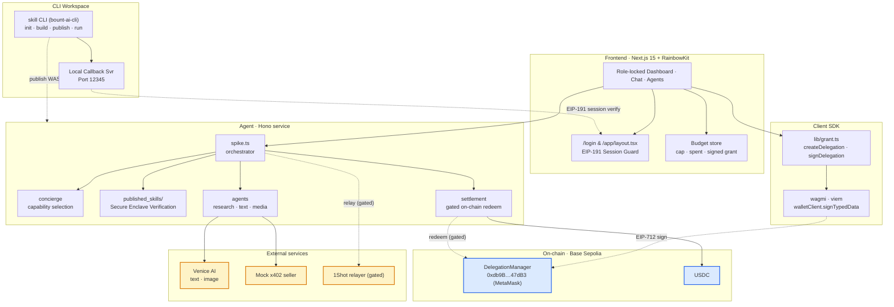
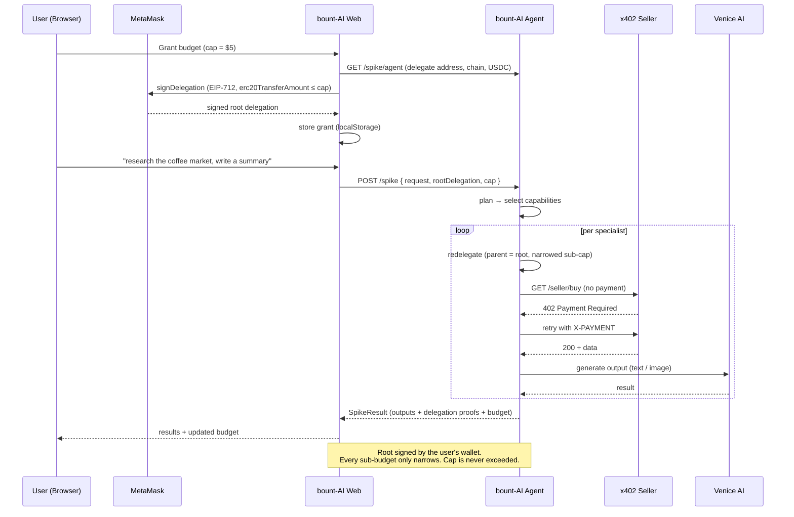

<p align="center">
  
</p>

<h1 align="center">bount-AI</h1>

<p align="center">
  <b>Give an AI a budget — not your wallet. Bounded, revocable spending powered by MetaMask Smart Accounts (ERC-7710 delegation), x402 payments, Venice AI, and compiled in Terminal 3 TEE enclaves.</b>
</p>

<p align="center">
  <a href="https://bount-ai-web.vercel.app"><b>Live App (dApp)</b></a>
  &nbsp;|&nbsp;
  <a href="https://bount-ai-agent.vercel.app/health"><b>Agent API Health</b></a>
  &nbsp;|&nbsp;
  <a href="https://www.npmjs.com/package/bount-ai-cli"><b>NPM CLI Package</b></a>
  &nbsp;|&nbsp;
  <a href="https://github.com/maulana-tech/bount-ai"><b>GitHub Repository</b></a>
</p>

<p align="center">
  
  &nbsp;&nbsp;
  
  &nbsp;&nbsp;
  
  &nbsp;&nbsp;
  
</p>

---

bount-AI is a secure Web3 application and developer CLI that enables AI agents to plan and execute transactions autonomously within strict budget limits. Deployed live on Base Sepolia, it uses MetaMask's Delegation Toolkit to enforce limits off-chain/on-chain, executes custom skills securely inside Terminal 3 TEE enclaves, and settles service fees using x402 micropayments.

---

## 📌 Table of Contents

- [The Problem](#the-problem)
- [The Solution](#the-solution)
- [System Architecture](#system-architecture)
- [Grant & Delegation Flow](#grant--delegation-flow)
- [The Specialist Agents](#the-specialist-agents)
- [How We Monetize](#how-we-monetize)
- [Live Deployment](#live-deployment)
- [Technical Deep Dive](#technical-deep-dive)
- [Repository Structure](#repository-structure)
- [CLI Tool Walkthrough](#cli-tool-walkthrough)
- [Getting Started (Local Development)](#getting-started-local-development)
- [Threat Model & Safety](#threat-model--safety)
- [Roadmap & Feature Status](#roadmap--feature-status)
- [Team](#team)
- [References](#references)
- [License](#license)

---

## ❌ The Problem

Giving an AI agent the ability to pay for services today requires handing over a **private key** or pre-funding a hot wallet it fully controls. This introduces massive security risks:

* **Unbounded** — A key holder can spend all funds in the wallet, not just a capped budget.
* **Irrevocable** — You cannot "un-give" a private key; you must move funds out to stop access.
* **Unauditable** — No native way to restrict spending to specific tasks or targets (e.g. "spend at most $5 on translation").
* **Unsafe to Compose** — Chaining agents (an agent hiring a sub-agent) multiplies the security blast radius.

As a result, most "AI + payments" demos remain read-only or rely on trusted backend APIs, sacrificing decentralization and composability.

---

## ✅ The Solution

bount-AI replaces custodial keys with **programmable, bounded delegation**. You grant the agent a capped, revocable spending limit by signing an EIP-7710 delegation with your wallet. The agent transacts autonomously, but the limits remain under your control.

* **Budget, Not Keys:** Sign a spending-limit delegation (using caveat `erc20TransferAmount`) capped at a specific USD limit (e.g., $5).
* **Secure Enclaves (Terminal 3 TEE):** Custom developer skills compile to WASM components and run inside verified, hardware-secured enclaves. No one can inspect or tamper with execution.
* **Agent-to-Agent Redelegation:** The parent agent breaks a request into sub-tasks and **redelegates** narrowed sub-budgets with specific target whitelists to specialist agents.
* **x402 Micropayments:** Specialist services settle payments through a standard `402 Payment Required → pay → retry → 200` loop.
* **Authority Only Narrows:** The sum of all sub-delegations can never exceed the initial root budget signed by the user.
* **Cryptographic Proofs:** Every step returns verifiable delegation hashes and execution traces.

---

## 🏛️ System Architecture



---

## 🔄 Grant & Delegation Flow

The lifecycle of an autonomous request from wallet signature to execution:



---

## 🤖 The Specialist Agents

bount-AI is general-purpose. Built-in capabilities are declared in `@concierge/shared` and dynamically mapped by the planner based on user requests:

| Agent | Purpose | Price / Use | Settles via |
| --- | --- | --- | --- |
| **Research** | Gather, clean, and summarize web data and competitive intelligence | $0.50 | `dataset` |
| **Copywriting** | Create marketing copy, summaries, email drafts, and articles | $0.20 | `text` |
| **Image** | Generate high-quality visual art, logos, and layouts | $0.80 | `image` |
| **Video** | Produce brief clips and animation loops | $1.00 | `video` |
| **Audio** | Generate synthetic voiceovers, music, and sound effects | $0.50 | `audio` |
| **Translation** | Translate and localize text across multiple languages | $0.20 | `text` |

#### Custom Developer Agents (Hybrid Model)
Sellers can build custom enclaves using the `bount-ai-cli` and publish them. When added, these enclaves appear in the global registry, execute in isolated enclaves, and monetize using the same x402 payment flow.

---

## 💰 How We Monetize

We monetize the usage of secure skills, not user wallets:
* **TEE Skill Marketplace:** Developers publish secure enclaves and charge usage fees. bount-AI takes a small protocol flat fee per invocation.
* **Micro-billing via x402:** Every agent-to-agent call requires micro-settlement. Other agents can query published TEE databases/models via `402 Payment Required` over HTTP.

---

## 🌐 Live Deployment

| Component | Network / URL | Address |
| --- | --- | --- |
| **Web Application** | [bount-ai-web.vercel.app](https://bount-ai-web.vercel.app) | Frontend Dashboard |
| **Agent API** | [bount-ai-agent.vercel.app/health](https://bount-ai-agent.vercel.app/health) | Backend Gateway |
| **Target Chain** | Base Sepolia | chainId `84532` |
| **DelegationManager** | `0xdb9B1e94B5b69Df7e401DDbedE43491141047dB3` | MetaMask Smart Accounts Kit |
| **USDC Token** | `0x036CbD53842c5426634e7929541eC2318f3dCF7e` | Base Sepolia USDC contract |
| **On-chain Settlement Proof** | [0x2d6f3b16...cc4d22](https://sepolia.basescan.org/tx/0x2d6f3b1660c90d5c5a15df8159e4f598cc85491d891a5303854288e4abcc4d22) | Base Sepolia USDC transfer |

---

## 🔍 Technical Deep Dive

### Layer 1: Cryptographic Permission Model
bount-AI implements off-chain EIP-712 signatures that act as counterfactual delegations.
1. **Root Delegation:** The browser constructs a delegation targeting the agent's stable delegate key with a budget cap caveat (`erc20TransferAmount`).
2. **Redelegation:** For each task, the agent signs a child delegation referencing the root delegation, narrowing the budget and limiting `allowedTargets`.

### Layer 2: Secure Sandbox (Terminal 3 ADK)
When executing custom developer skills:
1. TypeScript source code is compiled into WebAssembly (WASM).
2. Host APIs (like secure Key-Value and HTTP libraries) are resolved dynamically inside the enclave.
3. The host verifies the enclave attestation before execution, protecting sensitive user data.

### Layer 3: Dual-Mode x402 Settlement
* **x402 Loop:** Requests to paid specialist endpoints return `402 Payment Required`. The agent attaches the EIP-7710 delegation signature chain to the headers (`X-PAYMENT`) and retries the request.
* **Redemption:** The seller validates the signature chain and redeems the amount on-chain using MetaMask's `DelegationManager`. If gas or contract issues occur, it safely falls back to simulated settlement to preserve the user experience.

---

## 📂 Repository Structure

| Path | Purpose / Role |
| --- | --- |
| `apps/web/` | Next.js 15 Frontend (App Router, wagmi/viem EIP-7710 integrations) |
| `apps/agent/` | Hono Backend Service (Spike orchestrator, x402 payment, WASM sandbox) |
| `packages/shared/` | Shared TypeScript domain models & global capability registry |
| `packages/cli/` | Source code for `bount-ai-cli` (`skill`) npm developer package |
| `README.md` | General presentation and documentation |

---

## 🛠️ CLI Tool Walkthrough

bount-AI provides a developer CLI tool, published on the public npm registry as [`bount-ai-cli`](https://www.npmjs.com/package/bount-ai-cli). This CLI allows developers to bootstrap, compile, build, publish, and execute custom TEE skills inside secure enclaves.

### 📦 Installation Options

You can either install the CLI globally, use `npx` to run it on-the-fly, or run it from source inside the monorepo.

> [!TIP]
> Using **npx** allows you to run the commands without global installation overhead. Both `npx bount-ai-cli` and `npx -p bount-ai-cli skill` are fully supported.

##### Option A: Global Installation (Recommended)
Install the package globally:
```bash
npm install -g bount-ai-cli
```
This registers the global `skill` command. You can then run:
```bash
skill <command>
```

##### Option B: Run on-the-fly with `npx`
Run commands directly without installing:
```bash
npx bount-ai-cli <command>
```
*(Or use the explicit binary reference: `npx -p bount-ai-cli skill <command>`)*

##### Option C: Run from Source (For contributors/local development)
If you've cloned the repository and want to run it from source:
1. Build the workspace CLI package:
   ```bash
   pnpm --filter bount-ai-cli build
   ```
2. Run using node:
   ```bash
   node packages/cli/dist/cli.js <command>
   ```

---

### 🚀 CLI Commands Sequence

Here is the step-by-step developer workflow using the global `skill` command (replace with `npx bount-ai-cli` or `node packages/cli/dist/cli.js` depending on your option above):

##### Step 1: Login 🔑
Authenticate your local CLI session with your bount-AI identity:
```bash
skill login
```
* **How it works:** This boots a local callback server (on port `12345`) and automatically opens your browser.
* **Redirection:** By default, it opens the live app gateway: `https://bount-ai-web.vercel.app/app/cli-auth?port=12345`.
* **Action:** Log in with your MetaMask wallet on the dashboard and click **"Authorize CLI Login"** to sign the EIP-191 challenge. The session token is securely returned to your local machine and saved in `~/.config/bount-ai/config.json`.

> [!NOTE]
> **Developing locally?** You can redirect the CLI to your local frontend by running:
> `export BOUNT_AI_WEB_URL=http://localhost:3000` before running the login command.

##### Step 2: Initialize a TEE Skill 📁
Bootstrap a new custom TypeScript TEE skill template:
```bash
skill init my-premium-summarizer
```
* **Result:** Creates a new directory `my-premium-summarizer` containing an `index.ts` template pre-wired to resolve secrets securely via the Terminal 3 host API (`t3n:host/kv`) and execute confidential tasks.

##### Step 3: Build the Skill ⚙️
Navigate into your skill's directory and compile the TypeScript code into a secure WebAssembly (WASM) component:
```bash
cd my-premium-summarizer
skill build
```
* **Result:** Generates the secure sandbox binary `dist/index.wasm` utilizing standard `jco` and `wasi-js` TEE enclave tooling.

##### Step 4: Publish to the Registry 📤
Securely upload and register your compiled TEE skill component to the bount-AI registry:
```bash
skill publish
```
* **How it works:** Reads the current version, prompts for a patch version bump (e.g. `0.1.0 -> 0.1.1` to prevent version collision on-chain), and uploads the WASM bytecode to the agent registry.

##### Step 5: Execute the Secure Skill 🏃‍♂️
Trigger and execute your secure TEE skill from the terminal, which automatically processes the budget checks and x402 payment flow under the hood:
```bash
skill run my-premium-summarizer "Summarize competitor pricing"
```
* **Result:** The agent orchestrator runs your WASM component inside the sandboxed enclave, processes the delegated spending authorization, executes the prompt securely, and prints verified execution proofs along with the budget ledger.

---

## 🚀 Getting Started (Local Development)

### Prerequisites
* Node.js ≥ 20, pnpm ≥ 9
* A Web3 wallet with Base Sepolia testnet configuration.

### 1. Installation
Clone the repository and install all workspace dependencies:
```bash
git clone https://github.com/maulana-tech/bount-AI.git
cd bount-AI
pnpm install
```

### 2. Environment Configuration
Copy environment templates for both workspace apps:
```bash
cp apps/web/.env.example   apps/web/.env.local
cp apps/agent/.env.example apps/agent/.env.local
```
* **`apps/web/.env.local`**: Configure `NEXT_PUBLIC_WC_PROJECT_ID` with your WalletConnect/Reown project ID.
* **`apps/agent/.env.local`**: Add keys like `VENICE_API_KEY` (to enable Venice AI models) or private keys for RPC nodes.

### 3. Run Development Services
Start the frontend and backend agent concurrently:
```bash
pnpm dev
```
* **Frontend Web App:** Available at `http://localhost:3000`
* **Agent Backend API:** Available at `http://localhost:8787`

---

## 🔒 Threat Model & Safety

| Threat / Adversary | Strategy | How bount-AI Mitigates |
| --- | --- | --- |
| **Compromised Specialist Agent** | Tries to drain funds. | Bounded by EIP-7710 `erc20TransferAmount` caveat; can never spend more than its narrow sub-budget. |
| **Malicious Execution Host** | Attempts to sniff secrets/keys. | All custom execution runs inside secure Terminal 3 WASM enclaves (TEEs) with verified attestation. |
| **Agent Server Compromise** | Tries to sign malicious txs. | The agent only controls redelegation signatures; it cannot exceed the user's initial signed budget limit. |
| **Network Failure / Gas Spike** | Transaction stalls. | Dual-mode settlement guarantees graceful fallback to simulated mode, ensuring UX is never broken. |

---

## 🗺️ Roadmap & Feature Status

### Core Delivered Features
* [x] Wallet-signed EIP-7710 spending-limit delegation.
* [x] Agent-to-Agent redelegation with narrowed caveats and target whitelisting.
* [x] Sandboxed Terminal 3 TEE Enclave compilation and host verification.
* [x] Developer CLI package (`bount-ai-cli`) published to public npm registry.
* [x] Fully functional x402 payment loops against mock merchant services.
* [x] Venice AI text and image generation integrated into agent workflow.
* [x] Real-time budget tracking on frontend dashboard.
* [x] Gated on-chain USDC settlement on Base Sepolia.

### Next Development Phases
* [ ] Venice-driven dynamic LLM agent planner (replacing keyword heuristic).
* [ ] Multi-chain delegation manager selector.
* [ ] Persistent server-side database for custom seller enclaves.
* [ ] Streaming/recurring budget allowances.

---

## 👥 Team

Built by team **bount-AI**:
* **Maulana** — Full-stack developer & Integration engineer ([GitHub](https://github.com/maulana-tech))

---

## 📚 References
* [MetaMask Delegation Toolkit Docs](https://docs.metamask.io/delegation-toolkit/)
* [Terminal 3 Agent Dev Kit](https://terminal3.io)
* [EIP-7710 — Smart Contract Delegation](https://eips.ethereum.org/EIPS/eip-7710)
* [x402 Micropayments Standard](https://www.x402.org/)
* [Venice AI API Reference](https://docs.venice.ai/)

---

## 📄 License

Commercial software — all rights reserved. A `LICENSE` will be added before public release.

---

<p align="center">
  <b>bount-AI · Built for the Terminal 3 Agent Dev Kit Bounty Challenge</b><br>
  <i>Give an AI a budget — not your wallet.</i>
</p>
