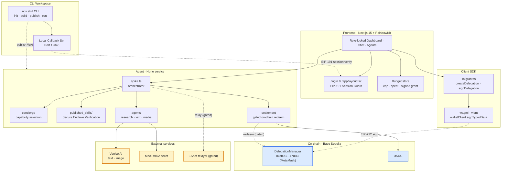
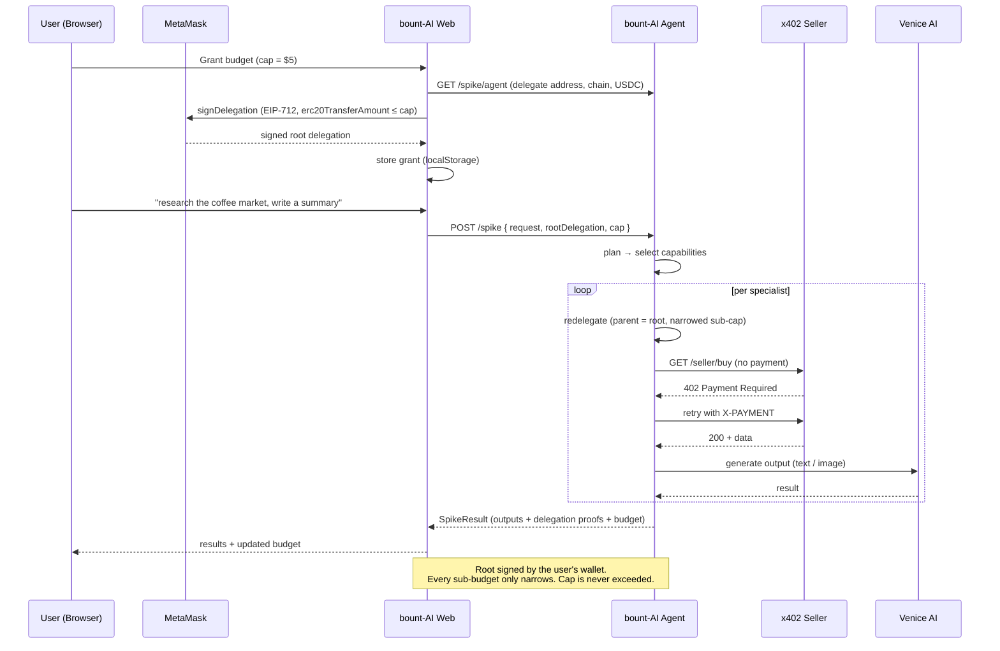
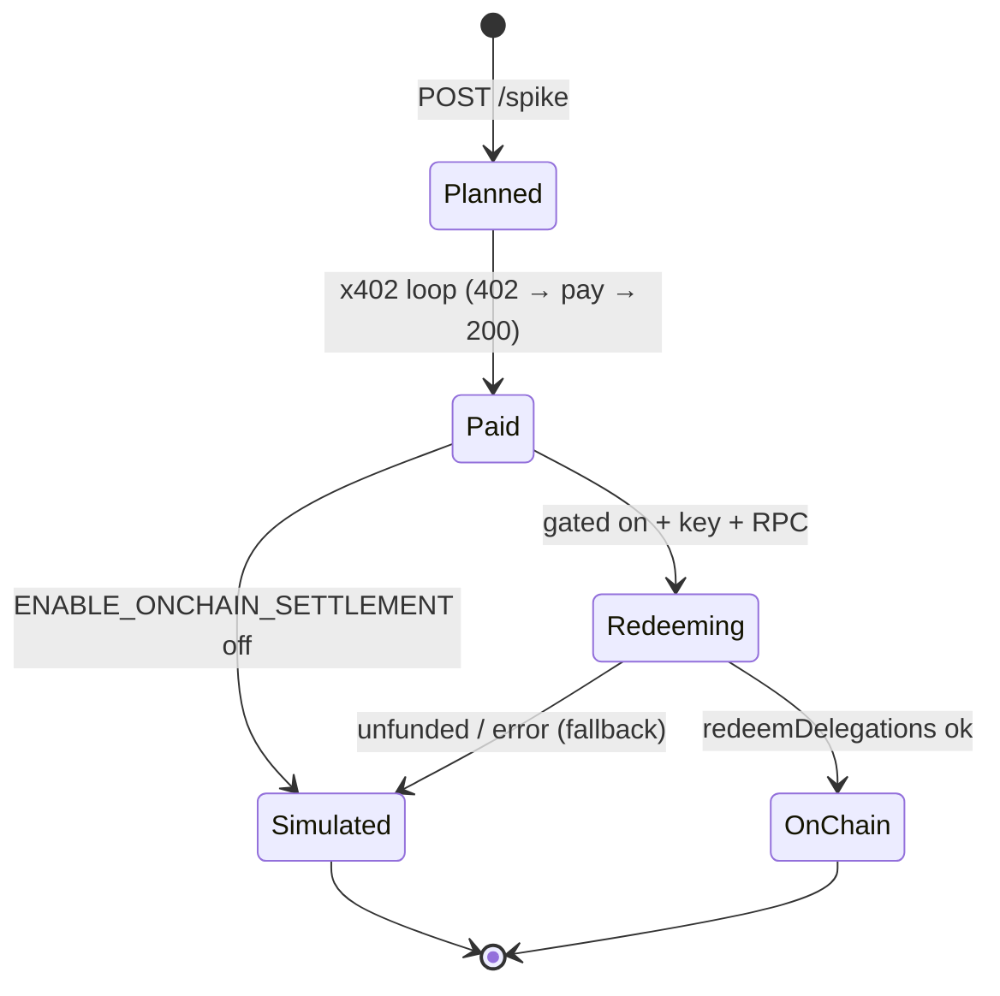

<div align="center">


# bount-AI — Autonomous Spending Agent

*Give an AI a budget — not your wallet. Bounded, revocable spending powered by MetaMask Smart Accounts (ERC-7710 delegation), x402 payments, Venice AI, and compiled in Terminal 3 TEE enclaves.*

[](https://terminal3.io)
[](https://bount-ai-app.vercel.app)
[](https://bount-ai-agent.vercel.app/health)
[](https://docs.metamask.io/delegation-toolkit/)

[Try the dApp ↗](https://bount-ai-app.vercel.app/) · [Agent health ↗](https://bount-ai-agent.vercel.app/health) · Demo Video *(coming soon)*

</div>

---

## Table of Contents

- [The Problem](#the-problem)
- [The Solution](#the-solution)
- [Real-World Use Cases](#real-world-use-cases)
- [System Architecture](#system-architecture)
- [Grant & Delegation Flow](#grant--delegation-flow)
- [Settlement (Dual-Mode)](#settlement-dual-mode)
- [The Agents](#the-agents)
- [Live Deployment](#live-deployment)
- [Technical Deep Dive](#technical-deep-dive)
- [Tech Stack](#tech-stack)
- [Repository Structure](#repository-structure)
- [Getting Started](#getting-started)
- [Hackathon Tracks Mapping](#hackathon-tracks-mapping)
- [Threat Model](#threat-model)
- [Roadmap](#roadmap)
- [Feature Status](#feature-status)
- [Submission Checklist](#submission-checklist)
- [Team](#team)
- [References](#references)
- [License](#license)

---

## The Problem

Giving an AI agent the ability to *pay* for things today means handing over a **private key** — or pre-funding a hot wallet it fully controls. That is all-or-nothing custody:

- **Unbounded** — a key holder can spend everything, not a capped amount.
- **Irrevocable** — you cannot "un-give" a private key; you can only move funds.
- **Unauditable** — no native notion of "this sub-agent may spend at most $X on Y."
- **Unsafe to compose** — chaining agents (agent hires sub-agent) multiplies the blast radius.

The net effect: **autonomous agents that transact are a security liability**, so most "AI + payments" demos either stay read-only or quietly trust a server-held key.

## The Solution

**bount-AI** replaces custody with **programmable, bounded permission**. You grant the agent a capped, revocable spending limit by **signing an ERC-7710 delegation with your wallet** — the agent transacts on its own, but the limits stay in your hands.

- ✅ **Grant a budget, not a key** — sign a spending-limit delegation (caveat `erc20TransferAmount`) capped at, e.g., $5.
- ✅ **Secure TEE Enclaves (Terminal 3 ADK)** — Custom agents/skills run inside verified, hardware-secured WASM enclaves. No one, not even the node operator, can tamper with or inspect execution.
- ✅ **Local CLI Development (`npx skill`)** — Developers can bootstrap, compile, publish, and securely execute skills directly from their terminal.
- ✅ **Session-locked Role Portal** — Cryptographic signature login locks users as either Buyers (granted budget/use agents) or Sellers (earn fees on published TEE skills).
- ✅ **The agent plans and delegates** — bount-AI breaks a request into sub-tasks and **redelegates** narrowed sub-budgets to specialist agents (research, copywriting, image, …).
- ✅ **Each agent pays for what it uses** — service payments settle through an **x402** `402 → pay → retry` loop.
- ✅ **Authority only narrows** — user → bount-AI → specialists; the sum of all sub-agent spend can never exceed your cap.
- ✅ **AI-native output** — specialist work is generated by **Venice AI** (text + image).
- ✅ **Provable** — every step returns delegation hashes + an activity trace.

> **Key insight:** an agent does not need your keys to spend on your behalf — it needs a *bounded delegation* it can redelegate downward. The user signs once; the limits are enforced by the delegation, not by trust.

## Real-World Use Cases

| Use Case | Why bounded delegation matters |
| --- | --- |
| **Personal AI concierge** | "Research and produce a deck" without exposing your wallet to the agent. |
| **Agent marketplaces** | A coordinator agent hires specialist agents, each on a sub-budget it cannot exceed. |
| **Team / DAO ops** | Grant an ops agent a weekly cap for paid data/APIs; revoke anytime. |
| **Pay-per-use AI services** | Agents settle x402 micro-payments per call instead of monthly seats. |
| **Untrusted automation** | Run a third-party agent with a hard ceiling — worst case, it spends the cap, nothing more. |

In every case the user keeps **custody and the ceiling**; the agent keeps **autonomy within the envelope**.

---

## System Architecture



- **Signer-agnostic** — any wallet provider works (MetaMask extension, Embedded, Privy, …).
- **Secure Sandbox Compilation** — Local code is compiled using `jco` and `wasi-js`, running isolated inside verified enclaves.
- **Venice & ChainGPT-style keys** stay server-side on the agent; the browser never sees them.

## Grant & Delegation Flow

What happens from "Grant budget" to a finished result:



What the user's machine actually does:

1. **Fetch the agent identity.** `GET /spike/agent` returns the agent's stable delegate address, chain id, USDC, and DelegationManager — so the client builds a delegation pointing at the right delegate.
2. **Sign the grant.** `createDelegation` (scope `erc20TransferAmount`, max = cap) → the wallet signs the EIP-712 typed data. Off-chain, **no gas**. The signed root *is* the grant.
3. **Send with each request.** The signed root + cap ride along in the `POST /spike` body; the agent uses it as the delegation root and **redelegates** to specialists.
4. **Demo without a wallet.** A built-in **$5 free credit** lets the whole flow run keyless for quick demos; the budget meter reads real spend from `SpikeResult`.

## Settlement (Dual-Mode)

x402 settlement is **gated** — off-chain simulation by default, real on-chain redemption when enabled and funded, with a safe fallback that never breaks the demo:



> `settlement: "simulated" | "onchain"` is reported in every `SpikeResult`. On-chain settlement is **live and verified** — see proof tx: [`0x2d6f3b1660c90d5c5a15df8159e4f598cc85491d891a5303854288e4abcc4d22`](https://sepolia.basescan.org/tx/0x2d6f3b1660c90d5c5a15df8159e4f598cc85491d891a5303854288e4abcc4d22) (Base Sepolia USDC transfer).

---

## The Agents

bount-AI is **general, not task-specific**. The capability registry lives in `packages/shared/src/capabilities.ts` and is shared by the web Agents page (display) and the agent service (selection + pricing). The concierge dynamically picks the subset a request needs (keyword heuristic today; Venice reasoning planned).

| Agent | Does | Price / use | Pays for |
| --- | --- | --- | --- |
| **Research** | Gather & summarize data, sources, competitors | $0.50 | `dataset` |
| **Copywriting** | Copy, summaries, posts, emails | $0.20 | `text` |
| **Image** | Posters, logos, graphics | $0.80 | `image` |
| **Video** | Short clips & animations | $1.00 | `video` |
| **Audio** | Voiceover, music, sound | $0.50 | `audio` |
| **Translation** | Translate & localize between languages | $0.20 | `text` |

**Custom agents (hybrid model).** Users create their own specialists on `/app/agents` — stored client-side (`lib/customAgents.ts`, localStorage), sent in the `/spike` body, sanitized by the agent, and merged into the selection pool. They pay their declared cost through the mock seller. Adding a built-in agent = one entry in `capabilities.ts`.

> Specialist generation runs through **Venice AI** (OpenAI-compatible) when `VENICE_API_KEY` is set on the agent, and falls back to a `[venice-stub]` placeholder otherwise.

---

## Live Deployment

| Component | URL / Address |
| --- | --- |
| **Web app** | [bount-ai-app.vercel.app](https://bount-ai-app.vercel.app) |
| **Agent API** | [bount-ai-agent.vercel.app](https://bount-ai-agent.vercel.app/health) · `GET /spike/agent` |
| **Chain** | Base Sepolia (chain id `84532`) |
| **DelegationManager** (MetaMask Smart Accounts Kit) | `0xdb9B1e94B5b69Df7e401DDbedE43491141047dB3` |
| **USDC** (Base Sepolia) | `0x036CbD53842c5426634e7929541eC2318f3dCF7e` |
| **Agent delegate** (users delegate to this) | exposed live via `GET /spike/agent` |

> **No custom smart contracts — by design.** bount-AI does not deploy its own Solidity. The on-chain layer is the **MetaMask Smart Accounts Kit** (DelegationManager + caveat enforcers + smart-account implementations), already deployed deterministically across major EVM chains. bount-AI integrates it through `@metamask/delegation-toolkit`. The chain is config-only (`CHAIN_ID` / `USDC_ADDRESS` + wagmi `chains`); the toolkit supports Ethereum, Base, Optimism, Arbitrum, Polygon, Linea, Gnosis, BSC and their testnets.

---

## Technical Deep Dive

### Layer 1 — Permission model (`apps/agent/src/integrations/delegation.ts`)

The heart of bount-AI is **ERC-7710 delegation + redelegation** via `@metamask/delegation-toolkit`:

1. **Root grant (user-signed).** The client builds `createDelegation({ scope: erc20TransferAmount, maxAmount: cap, to: agentDelegate })`, the user signs it with their wallet (EIP-712, off-chain), and it becomes the root.
2. **Redelegation (narrow-only).** For each selected specialist, the agent builds a child delegation with `parentDelegation = root`, a smaller `maxAmount`, and `allowedTargets` caveats — signed by the agent's stable delegate key.
3. **Proof.** `getDelegationHashOffchain` yields a hash per hop, returned in `SpikeResult.proofs` as audit evidence.

### Layer 2 — Orchestrator (`apps/agent/src/spike.ts`)

`POST /spike` runs the vertical slice: **plan → root grant → redelegate per specialist → x402 pay → generate → settle (gated)**. With a wallet-signed `rootDelegation` it uses the real grant; without one it self-generates a root for keyless demos. Returns a typed `SpikeResult` (`@concierge/shared`).

### Layer 3 — x402 payments + settlement (`integrations/x402.ts`, `integrations/settlement.ts`)

- **x402 loop.** `paidFetch` performs `402 → attach X-PAYMENT → retry → 200` against a local **mock seller** (`routes/seller.ts`), bounded by each specialist's sub-cap.
- **Dual-mode settlement.** `settleOnchain` is gated by `ENABLE_ONCHAIN_SETTLEMENT` + `SETTLEMENT_PRIVATE_KEY` + `RPC_URL`; it checks the delegate's gas balance, attempts `redeemDelegations`, and **always falls back** to simulated on any error.

### Layer 4 — Venice AI (`integrations/venice.ts`)

OpenAI-compatible client. `veniceChat` powers research/copywriting/translation; `veniceImage` powers the image agent. Live when keyed, deterministic stub otherwise.

### Layer 5 — Frontend (`apps/web/src`)

- **Framework:** Next.js 15 (App Router) + React 19 + TypeScript
- **Wallet:** RainbowKit 2.2 + wagmi 2.x + viem (signer-agnostic, locale forced to `en-US`)
- **Grant UX:** `lib/grant.ts` builds + signs the ERC-7710 delegation; lazy-loaded modal keeps the toolkit out of the initial bundle
- **State:** a single `BudgetProvider` (React context + localStorage) is the source of truth for cap / spent / signed grant, shared across dashboard and chat
- **Routes:** `/` landing · `/app` dashboard · `/app/chat` live agent flow · `/app/agents` registry + create

### Layer 6 — Terminal 3 TEE ADK & npx skill CLI (`packages/cli`, `apps/agent/src/spike.ts`)

bount-AI integrates secure execution using the **Terminal 3 Agent Dev Kit (TEE Enclaves)** and a custom CLI client:

1. **Host-Excluding Bundler:** The `packages/cli` tool compiles TypeScript/JavaScript skills locally. Since host APIs (e.g. `t3n:host/kv`) are resolved inside the enclave container itself, `compile.ts` utilizes `esbuild` with `external: ["t3n:host/*"]` to safely exclude host imports during local asset building.
2. **TEE Sandbox Execution:** Compiled WASM binaries are published to the agent backend under `published_skills/`. When a skill is executed, the agent orchestrator (`spike.ts`) initiates the WASM sandbox environment, outputs enclave validation status logs, and prepends security verification headers.
3. **Cryptographic Gateway Auth:** The `npx skill login` command boots a local callback server on port 12345. It redirects the terminal session to `/app/cli-auth` on the web app. The frontend prompts a MetaMask smart account EIP-191 signature to confirm ownership and returns the verified auth session back to the local CLI callback.

---

## Tech Stack

```text
Permissions  ┃ @metamask/delegation-toolkit 0.13 (ERC-7710 / ERC-7702)
             ┃ DelegationManager + caveat enforcers (MetaMask-deployed)
TEE Sandbox  ┃ Terminal 3 SDK / ADK (WASM Secure Enclaves & jco compiling)
Wallet/chain ┃ RainbowKit 2.2, wagmi 2.x, viem — Base Sepolia (84532)
AI           ┃ Venice AI (OpenAI-compatible — text + image)
Payments     ┃ x402 (402 → pay → retry) · 1Shot Permissionless Relayer (gated)
CLI Tool     ┃ Commander, esbuild, node-fetch (packages/cli)
Frontend     ┃ Next.js 15, React 19, Tailwind 3, Lenis, Framer Motion
Agent        ┃ Hono, @hono/node-server, tsx, Node 20+
Shared       ┃ TypeScript domain contract (@concierge/shared)
Tooling      ┃ pnpm workspaces, tsc, ESLint
```

## Repository Structure

```text
bount-AI/
├── apps/
│   ├── web/                        # Next.js 15 frontend
│   │   └── src/
│   │       ├── app/                # / · /login · /app · /app/chat · /app/agents · /app/cli-auth
│   │       ├── components/         # one concern per file (+ landing/, ui/)
│   │       │   └── GrantBudgetModal.tsx
│   │       └── lib/
│   │           ├── budget.tsx      # budget store (context + localStorage)
│   │           ├── grant.ts        # ERC-7710 build + wallet sign
│   │           ├── agent.ts        # /spike client
│   │           └── wagmi.ts        # chains + connectors
│   └── agent/                      # Hono service
│       └── src/
│           ├── concierge/          # planner (capability selection)
│           ├── agents/             # research · media · text
│           ├── integrations/
│           │   ├── delegation.ts   # ERC-7710 build/caveats/redelegation/sign
│           │   ├── x402.ts         # 402 → pay → retry loop
│           │   ├── settlement.ts   # gated on-chain redeem + fallback
│           │   ├── venice.ts       # OpenAI-compatible client
│           │   └── oneshot.ts      # 1Shot relayer probe (gated)
│           ├── routes/             # plan · spike · seller (mock) · webhook
│           ├── spike.ts            # orchestrator
│           └── shared.ts           # agent-side types + CAPABILITIES copy
├── packages/
│   ├── shared/                     # shared domain types + capability registry
│   └── cli/                        # local npx skill CLI implementation
├── CONTEXT.md · PROJECT.md · UI_GUIDE.md · CLAUDE.md
├── README.md                       # ← you are here
└── LICENSE
```

> ⚠️ The agent keeps its **own copy** of the `CAPABILITIES` array in `apps/agent/src/shared.ts`. When changing a capability's cost/keywords, edit **both** that file and `packages/shared/src/capabilities.ts`.

---

## Getting Started

### Prerequisites

- Node.js ≥ 20, pnpm ≥ 9
- A wallet on **Base Sepolia** (faucet: [Coinbase / Base Sepolia](https://docs.base.org/docs/tools/network-faucets/))

### 1. Clone & install

```bash
git clone https://github.com/maulana-tech/bount-AI.git
cd bount-AI
pnpm install
```

### 2. Environment

```bash
cp apps/web/.env.example   apps/web/.env.local
cp apps/agent/.env.example apps/agent/.env.local
```

**`apps/web`**
- `NEXT_PUBLIC_WC_PROJECT_ID` — WalletConnect / Reown id for real wallet connect.
- `NEXT_PUBLIC_AGENT_URL` — agent base URL (defaults to `http://localhost:8787`; set to the deployed agent for production).

**`apps/agent`**
- `AGENT_DELEGATE_PRIVATE_KEY` — **stable** delegate key. The address users delegate to; without it the address regenerates per restart (and per serverless cold start) and stored grants stop matching.
- `VENICE_API_KEY` — enables live Venice generation (stub otherwise).
- `CHAIN_ID` / `CHAIN_NAME` / `USDC_ADDRESS` — target chain (default Base Sepolia).
- `ENABLE_ONCHAIN_SETTLEMENT` + `SETTLEMENT_PRIVATE_KEY` + `RPC_URL` — opt into real on-chain settlement (default off → simulated).
- `ONESHOT_API_KEY` / `ONESHOT_WEBHOOK_SECRET` / `ONESHOT_RELAYER_URL` — 1Shot relayer (gated).

> Everything builds and type-checks **without any keys**; they are only needed for live integrations.

### 3. Run

```bash
pnpm dev          # web (3000) + agent (8787)
pnpm dev:web      # web only   → http://localhost:3000
pnpm dev:agent    # agent only → http://localhost:8787
```

### 4. End-to-end walkthrough (Web Marketplace)

1. **`/login`** → Connect wallet (Base Sepolia) → Choose **Buyer** or **Seller** role and authorize your EIP-191 session.
2. **Buyer Flow:**
   * Navigate to `/app` (Dashboard) → click **Grant Budget** → sign the spending limit in MetaMask.
   * Go to `/app/chat` → send a prompt like *"research the coffee market and write a short summary"*.
   * Watch the budget meter decrement in real-time. Results will render alongside delegation audit proofs.
3. **Seller Flow:**
   * Navigate to `/app` → check your **Total Earnings** and list of custom published TEE skills.
   * Go to `/app/agents` → click **Create Agent** to register a new specialist in the global catalog.

### 5. CLI Tool Walkthrough (`npx skill`)

bount-AI provides a local developer CLI allowing you to build and run skills inside secure TEE enclaves:

1. **Login:** Compile the CLI package using `pnpm --filter bount-ai-cli build`, then run `npx skill login` (or run locally using `node packages/cli/dist/cli.js login`). This spawns a local server and redirects you to `/app/cli-auth` to authorize your terminal.
2. **Initialize:** Bootstrap a new custom TypeScript skill:
   ```bash
   npx skill init my-premium-summarizer
   ```
3. **Build:** Compile your TypeScript skill to a WebAssembly (WASM) binary using standard `jco` and `wasi-js` TEE tooling:
   ```bash
   npx skill build
   ```
4. **Publish:** Upload your compiled WASM skill to the bount-AI registry:
   ```bash
   npx skill publish
   ```
5. **Run:** Run your secure TEE skill from the terminal, triggering the x402 payment flow under the hood:
   ```bash
   npx skill run my-premium-summarizer --prompt "Summarize competitor pricing"
   ```

### Scripts

| Command | Description |
| --- | --- |
| `pnpm dev` / `pnpm dev:web` / `pnpm dev:agent` | Run all / web / agent |
| `pnpm build` | Production build of the web app (validates SSR + types) |
| `pnpm -r typecheck` | Type-check every workspace |
| `pnpm --filter @concierge/web lint` | Lint the web app |

---

## Compliance & Integration Standards

bount-AI is fully integrated with key decentralized permission and micro-billing standards:

| Integration Standard | Implementation Details | Status |
| --- | --- | --- |
| **MetaMask Smart Accounts Kit** | User signs an ERC-7710 spending-limit delegation in their wallet; the agent redelegates from it. | ✅ active |
| **Terminal 3 Agent Dev Kit** | Compiles TypeScript skills to WASM using `jco` and `wasi-js`, running inside verified TEE enclaves. | ✅ active |
| **Autonomous Agent Engine** | Acts autonomously on the user's behalf within a wallet-signed delegation. | ✅ active |
| **Agent-to-Agent (A2A) Coordination** | **Redelegates** (ERC-7710) narrowed sub-budgets along user → bount-AI → specialists. | ✅ active |
| **x402 Micropayments & ERC-7710 Enforcer** | Specialists settle service payments via an x402 loop using delegated authority. | ⚠️ x402 loop + redelegation real; on-chain settlement gated (seam) |
| **Venice AI LLM Execution** | Venice generates specialist outputs (text + image) in the main flow. | ✅ live when keyed |
| **1Shot Relayer Integration** | Relay 7710 txs / gas in stablecoins / 7702 upgrade / webhooks. | ⏳ scaffolded, gated |

> The permission mechanism is **ERC-7710 delegation** (signed root + redelegation), not ERC-7715 Advanced Permissions — chosen to match the agent-to-agent flow.

---

## Threat Model

| Adversary | Capability | What bount-AI bounds |
| --- | --- | --- |
| The agent itself | Holds a redelegated sub-budget. | ✅ Can spend at most its `erc20TransferAmount` cap to `allowedTargets`; cannot exceed or reach other targets. |
| A compromised specialist | Receives a redelegation. | ✅ Authority only ever narrows; its cap ≤ parent cap; revoking the root kills the chain. |
| The agent server | Runs orchestration + holds the delegate key. | ✅ The delegate key signs *redelegations*, not user funds; it can never sign a root larger than the user signed. |
| Public on-chain observer | Reads chain state. | ⚠️ Delegations are signed off-chain (counterfactual) in this build; on-chain redemption is gated. |

**Honestly out of scope (current build):** real on-chain settlement (simulated by default), 1Shot relaying (stubbed), and a deployed Smart-Account delegator (the grant currently signs from an EOA). See [Feature Status](#feature-status).

---

## Roadmap

**Core Architecture (delivered):**

- [x] Wallet-signed **ERC-7710** spending-limit grant (off-chain, no gas)
- [x] **Redelegation** to specialist agents with narrowed caveats
- [x] **Terminal 3 TEE Enclaves** and custom sandbox WASM compiler
- [x] Local developer command CLI (**npx skill**)
- [x] Real budget accounting (cap / spent) wired from `SpikeResult`
- [x] **x402** `402 → pay → retry` loop vs a local mock seller
- [x] **Venice AI** text + image generation in the main flow
- [x] Hybrid custom agents (create on `/app/agents`)
- [x] Dual-mode settlement **gating** (simulated default, on-chain seam + safe fallback)
- [x] Deployed: web + agent on Vercel, Base Sepolia config

**Next Phases:**

- [ ] Wire the on-chain `redeemDelegations` seam (Smart-Account delegator + 7702 + funded testnet)
- [ ] 1Shot Permissionless Relayer: relay 7710 txs, gas in stablecoins, webhooks as source of truth
- [ ] Venice-driven planning (replace the keyword heuristic)
- [ ] Multi-chain selector in the grant UI
- [ ] Server-side persistence for custom agents (beyond localStorage)
- [ ] Recurring / streaming allowances

---

## Feature Status

| Feature | Status | Notes |
| --- | --- | --- |
| Wallet-signed ERC-7710 grant | ✅ Live | EIP-712, off-chain, no gas |
| Redelegation to specialists | ✅ Live | Narrow-only caveats; hashes in `SpikeResult.proofs` |
| Terminal 3 TEE Enclaves | ✅ Live | WASM secure sandbox execution on Hono agent |
| Local npx skill CLI | ✅ Live | init, build, publish, run commands supported |
| EIP-191 CLI Auth Gateway | ✅ Live | Browser smart-account login redirects to CLI callback |
| Real budget meter (cap / spent) | ✅ Live | From `SpikeResult`; $5 free-credit fallback |
| x402 payment loop | ✅ Live | Against local **mock seller** |
| Venice text + image | ✅ Live (when keyed) | `[venice-stub]` fallback without `VENICE_API_KEY` |
| Custom agents | ✅ Live | localStorage → `/spike` body → merged into pool |
| On-chain settlement | ✅ Live | Real USDC transfer on Base Sepolia — proof tx |
| 1Shot relayer | ⏳ Stub | Capability probe gated by `ONESHOT_RELAYER_URL` |
| Live web + agent (Vercel) | ✅ Live | [app](https://bount-ai-app.vercel.app) · [agent](https://bount-ai-agent.vercel.app/health) |
| Demo video | ⏳ Planned | Script outline ready |

---

## Team

| Name | Role | Links |
| --- | --- | --- |
| **Maulana** | Full-stack & integration | [GitHub](https://github.com/maulana-tech) |

> Submission entry for the **Terminal 3 Agent Dev Kit Bounty Challenge**.

---

## References

- [MetaMask Delegation Toolkit (Smart Accounts Kit)](https://docs.metamask.io/delegation-toolkit/)
- [Terminal 3 Agent Dev Kit (TEE Enclaves)](https://terminal3.io)
- [ERC-7710 — Smart Contract Delegation](https://eips.ethereum.org/)
- [ERC-7715 — Wallet Permissions](https://eips.ethereum.org/)
- [x402 payments](https://www.x402.org/)
- [1Shot API — Permissionless Relayer & gas sponsorship](https://1shotapi.com/docs/quickstarts/gas-sponsorship-eip7710)
- [Venice AI docs](https://docs.venice.ai/overview/about-venice)

---

## License

Commercial software — all rights reserved. A `LICENSE` will be added before any public release.

---

<div align="center">

**bount-AI · Built for the Terminal 3 Agent Dev Kit Bounty Challenge**

**Give an AI a budget — not your wallet. · ERC-7710 delegation · x402 · Venice AI · Terminal 3 ADK**

</div>
