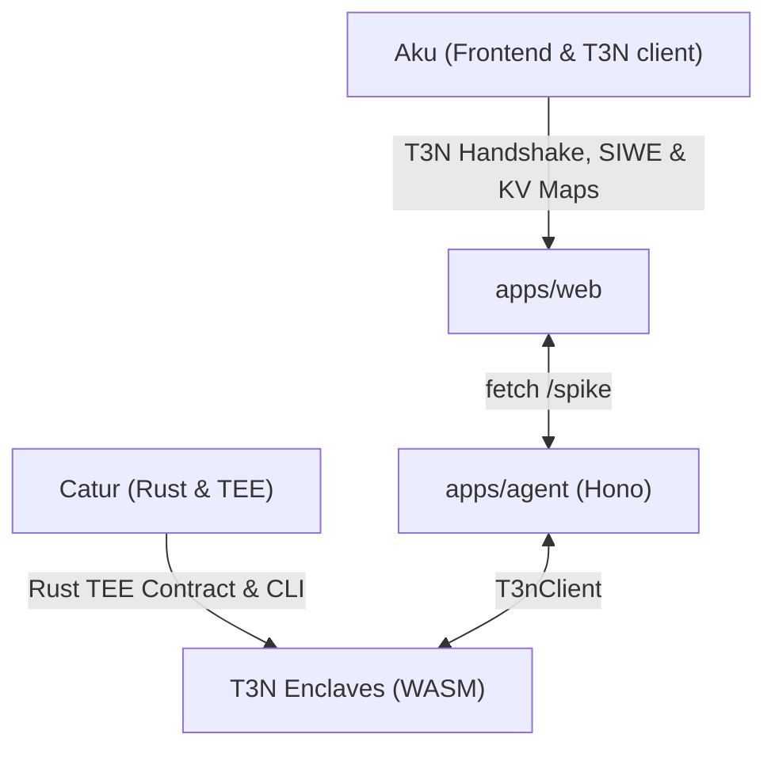

# Task List — bount-AI (T3N ADK Bounty Focus)

Dokumen ini membagi tugas pengembangan sisa (Fase 3 & 4) antara **Aku** (Frontend, T3N Client & Wallet Authentication) dan **Catur** (Rust, WASM & T3N Enclave Development) untuk memenangkan T3N ADK Bounty Challenge.

---

## 📋 Pembagian Peran (Dev Matrix)

---

## 👤 Tugas: Aku (Frontend, T3N Client & Wallet Authentication)

Fokus utama adalah mengintegrasikan T3N client secara interaktif di dashboard Web UI agar user bisa mengelola identitas dan data privat mereka di TEE.

- [x] **1. Integrasi Login MetaMask & T3N Handshake**
  * *Deskripsi:* Implementasikan login dengan MetaMask di frontend untuk memicu `t3n.handshake()` dan `t3n.authenticate()` menggunakan standard SIWE (Sign-In with Ethereum). Simpan DID hasil autentikasi (`did:t3n`) di local session.
  * *Lokasi Kode:* [apps/web/src/app/providers.tsx](file:///Users/em/web/bount-ai/apps/web/src/app/providers.tsx) & [apps/web/src/components/GrantBudgetModal.tsx](file:///Users/em/web/bount-ai/apps/web/src/components/GrantBudgetModal.tsx)

- [x] **2. T3N Private/Public KV Maps Manager (Web UI)**
  * *Deskripsi:* Buat panel khusus di dashboard untuk membuat (`tenant.maps.create`), menampilkan, dan menghapus key-value maps di namespace `z:<tid>:*` secara visual langsung dari browser.
  * *Lokasi Kode:* [apps/web/src/app/app/page.tsx](file:///Users/em/web/bount-ai/apps/web/src/app/app/page.tsx)

- [x] **3. Sandbox User Profile & Placeholders Testing**
  * *Deskripsi:* Sediakan form untuk memperbarui data user profile di TEE (seperti `first_name`, `email`). Tambahkan simulator untuk menguji outbound call dengan data PII tersamar (`{{profile.first_name}}`) guna memamerkan fitur Zero-Disclosure T3N.
  * *Lokasi Kode:* [apps/web/src/app/app/page.tsx](file:///Users/em/web/bount-ai/apps/web/src/app/app/page.tsx)

- [x] **4. TEE Contracts Control Panel**
  * *Deskripsi:* Tampilkan daftar kontrak enclaves yang terdaftar di tenant, beserta status aktivasinya (aktif/nonaktif). Tambahkan tombol untuk memicu upload dan registrasi kontrak baru.
  * *Lokasi Kode:* [apps/web/src/app/app/page.tsx](file:///Users/em/web/bount-ai/apps/web/src/app/app/page.tsx)

---

## 👤 Tugas: Catur (Rust, WASM & T3N Enclave Development)

Fokus utama adalah mengganti WASM stub tiruan (8-byte) menjadi TEE contract asli dalam bahasa Rust yang mengekspor WIT interface dengan benar.

- [x] **1. Setup Proyek Rust & Wasm32-Wasip2 Toolchain**
  * *Deskripsi:* Buat sub-folder `packages/enclaves` atau crate Rust baru dengan konfigurasi `Cargo.toml` (`crate-type = ["cdylib"]`) untuk meng-compile guest component target `wasm32-wasip2`.
  * *Lokasi Kode:* Root folder / `packages/enclaves`

- [x] **2. Implementasi WIT Interface Guest Export**
  * *Deskripsi:* Buat file `wit/world.wit` yang mengekspor interface `contracts` dengan method `execute(input: string) -> result<string, string>`. Implementasikan handler-nya di `src/lib.rs`.
  * *Lokasi Kode:* `packages/enclaves/wit/world.wit` & `packages/enclaves/src/lib.rs`

- [x] **3. Panggilan Konfidensial (Confidential HTTP) dalam Enclave**
  * *Deskripsi:* Impor dan panggil host capability `t3n:host/http` di dalam kontrak Rust untuk melakukan pemanggilan aman ke API Venice AI directly dari dalam enclave node.
  * *Lokasi Kode:* `packages/enclaves/src/lib.rs`

- [x] **4. Integrasi KV Store T3N**
  * *Deskripsi:* Gunakan `t3n:host/kv` untuk membaca `VENICE_API_KEY` secara aman dari namespace privat T3N (`z:<tid>:secrets`) agar kunci API tidak terekspos di memori WASM biasa.
  * *Lokasi Kode:* `packages/enclaves/src/lib.rs`

- [x] **5. Otomatisasi Versi Kontrak pada CLI Build & Publish**
  * *Deskripsi:* Perbaiki CLI agar membaca versi dari `Cargo.toml` (atau menanyakan input versi baru) setiap kali menjalankan `skill publish`, guna menghindari error `version is not higher than current version` dari T3N.
  * *Lokasi Kode:* [packages/cli/src/publish.ts](file:///Users/em/web/bount-ai/packages/cli/src/publish.ts)

---

## 🤝 Integrasi Bersama (Testing & Demo)

Setelah tugas-tugas di atas selesai, kalian perlu berkolaborasi pada:

- [x] **1. Pengujian E2E di T3N Testnet**:
   * Jalankan alur registrasi kontrak riil → set KV maps & secrets (Venice API Key) → jalankan pemanggilan `/spike` untuk memicu eksekusi TEE riil di node T3N testnet.
- [x] **2. Video Demo Walkthrough**:
   * Menunjukkan login dengan MetaMask untuk mendapatkan DID `did:t3n`.
   * Menunjukkan dashboard web mengelola KV maps dan data sensitif secara aman.
   * Menunjukkan eksekusi agent yang memproses PII tersamar via placeholders, membuktikan data rahasia tidak pernah keluar dari enclave.
